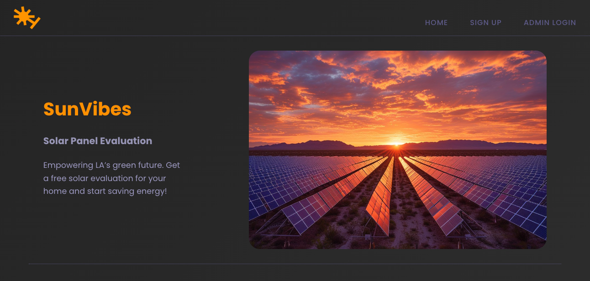

## Hero Section  

---

# Overview

Developed as part of Chingu Voyage 52 Tier 1 - by team 5
Web application to streamline the process of scheduling solar panel evaluations. Designed for Los Angeles residents and City Hall employees, the app emphasizes efficient communication and scheduling while showcasing foundational web development skills, such as HTML, CSS, and JavaScript. The project also provided an opportunity to work collaboratively in a team environment.

---

## Live Demo  
**[View Deployed Demo Application](https://solar-vibes-la.netlify.app/)**

---

## Admin Login Credentials  
- **Username:** `admin`  
- **Password:** `password123`

---

## How It Works  

**Admin Login** - log in as a city employee and view all existing appointments in a paginated, responsive and filterable view (67 mock appointments generated automatically)

**Booking an appointment** - open the signup form and create a new appointment input your information with LA County zip code and home address (preferably select address from popup menu when possible)

---

## Key Features  

- **For Los Angeles Residents:**
  - A user-friendly and informative web application for scheduling solar panel evaluation appointments
  - In case a session is interupted (i.e. page reload) the form will continue submitting in next session
  - Address suggestions pop-up menu - searches the database for valid addresses (__works better when zip code is inputed first, then street address__)
    
- **For City Employees:**
  - Intuitive log-in through modal window
  - Appointment management tool to easily review and manage visits effectively;
  - Addresses inputed by customers get validated against LA County city database;

- **Data Persistence:**  
  - Appointments and user data are stored securely in IndexedDB and localStorage, ensuring seamless continuity across sessions;

- **Responsive Vibrant Design:**  
  - The "SunVibes" logo and vibrant color palette with orange and purple dominating to capture the energetic yet a-back spirit of Los Angeles;

---

## Built With  

- **Core Web Technologies:** HTML, CSS, JavaScript;
- **Design:** Modern CSS including media queries for responsive design;
- **Data Management:** IndexedDB (_city database_) and localStorage for persistent; data storage (_appointments_);
- **Notable depencencies:** Notyf (notifications, alerts), parcel (bundling), just-validate (form validation and error handling);
- **Project Backlog:** Trello;
- **Design framework** Figma;

---

## Project Workflow  

This project followed a collaborative development process, incorporating:  
- **Agile Development Principles:** Regular sprints and iterative improvements;
- **Version Control:** Git and GitHub for code management and collaboration;
- **Team Communication:** Active discussions to align on goals, features, and deadlines;

---

## Contributors

- Bogdan Terzic (Bobby): [GitHub](https://github.com/minorObsession) | [LinkedIn](https://linkedin.com/in/bogdan-terzic-606340249/)
- Christina Ligare (Chris): [GitHub](https://github.com/codercreative) | [LinkedIn](https://www.linkedin.com/in/christina-ligare/)
- Guillermo Guevara (Memo): [GitHub](https://github.com/guillermoguevara887) / [LinkedIn](https://www.linkedin.com/in/guillermo-guevara-6758a51a0?trk=contact-info)
- Marisela Gomez (Sela): [GitHub](https://github.com/Mar1g0m3z) | [LinkedIn](https://www.linkedin.com/in/sela-dev/)
- Sarita Jha: [LinkedIn](https://www.linkedin.com/in/sjhabsc/)
- Noelle Jefferson: [LinkedIn](https://www.linkedin.com/in/noelle-jefferson/)
